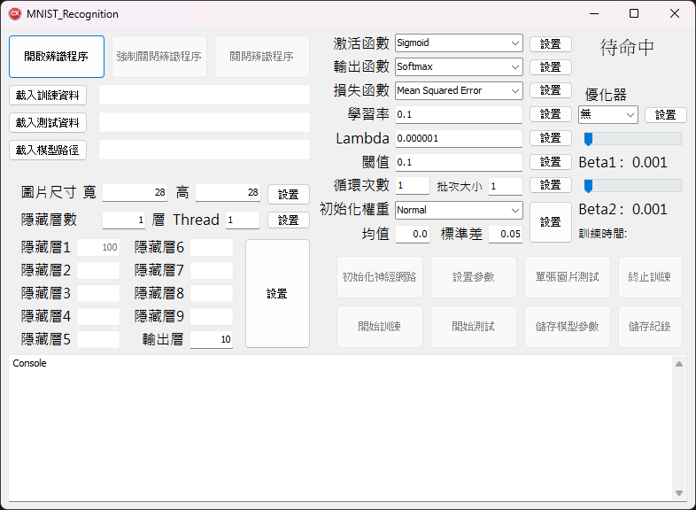
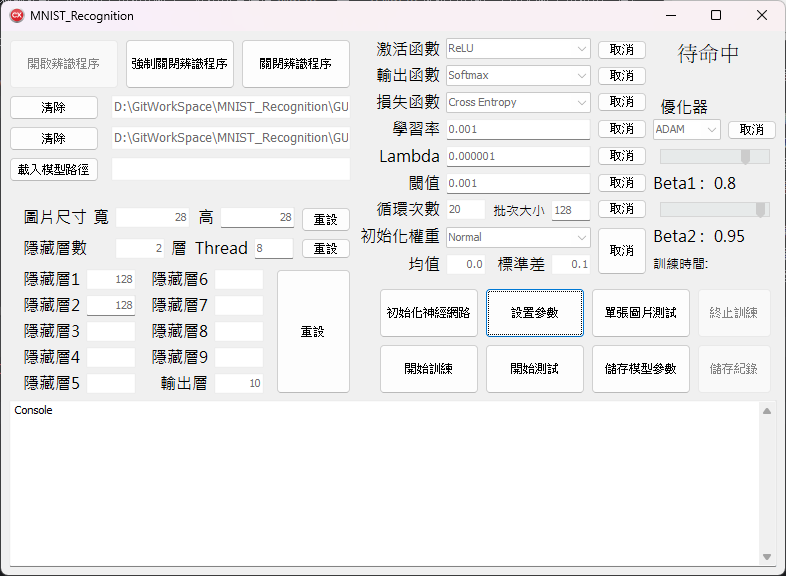
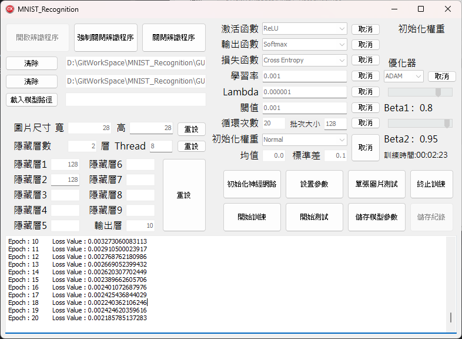
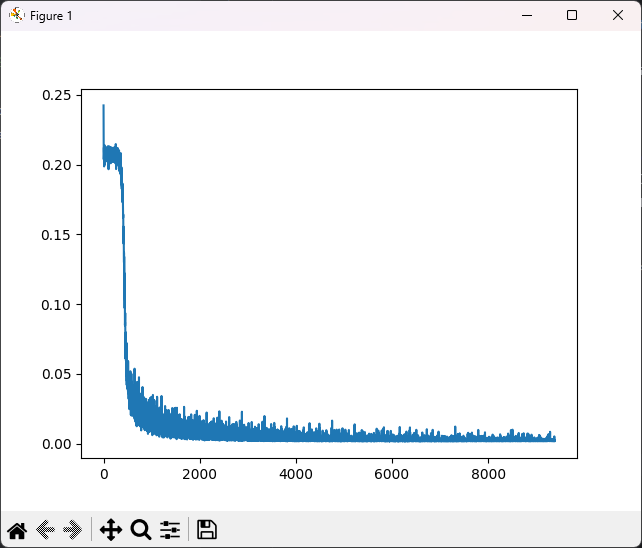
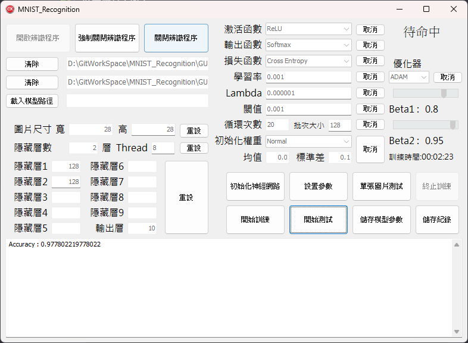
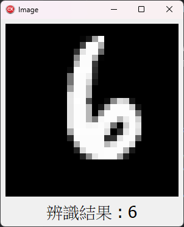

# C++語言實作神經網路框架Demo

## 預先準備

1. 會使用到matplotlib，請先下載python 3.11並安裝matplotlib。
2. 訓練集與測試集分別在./GUI/train與./GUI/test裡。
3. 執行./GUI/MNIST_Recognition.exe即可開啟Demo程式。

## 使用說明

1. 請先開啟辨識程序，這將會啟動./GUI/bin/MNIST_Recognition_EXE.exe，我們將透過這個程式與網路交互。
2. 載入訓練與測試資料夾位置，本Demo有準備圖檔位於./GUI/train與./GUI/test裡。
3. 本Demo僅適用於展示MNIST資料集的訓練成果，請不要更動圖片尺寸。
4. 設置隱藏層數與節點數，同上，請不要更動輸出層的節點數，MNIST資料集為0~9的數共十個分類。
5. 請先初始化神經網路。
5. 設置剩餘參數，特別留意初始化權重，此項沒有選擇<mark>__無__</mark>按設置的話，皆會將權重初始化，若是訓練完後修改參數要繼續訓練的話請選擇<mark>__無__</mark>。
6. 可以開始訓練資料集，訓練後可以可以選擇測試集進行驗證，或是單張圖片進行預測。
7. 此版本若訓練至閾值後，將會將數據打亂並繼續訓練。

## 範例
1. 設置
---

2. 訓練
---

3. 測試
---

4. 預測
---

